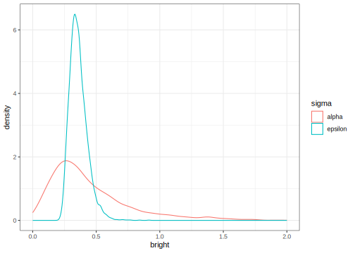

# One Way Anova with a random effect using Cmdstan
[Julian Faraway](https://julianfaraway.github.io/)
2023-06-23

- [Data](#data)
- [CMDSTAN](#cmdstan)

``` r
library(faraway)
library(cmdstanr)
library(ggplot2)
library(bayesplot)
```

# Data

Load up and look at the data, which concerns the brightness of paper
which may vary between operators of the production machinery.

``` r
data(pulp, package="faraway")
summary(pulp)
```

         bright     operator
     Min.   :59.8   a:5     
     1st Qu.:60.0   b:5     
     Median :60.5   c:5     
     Mean   :60.4   d:5     
     3rd Qu.:60.7           
     Max.   :61.0           

``` r
ggplot(pulp, aes(x=operator, y=bright))+geom_point(position = position_jitter(width=0.1, height=0.0))
```


# CMDSTAN

- Load in the STAN file without compiling
- Look at it
- Update a deprecated expression (fixing this in the source would break
  rstan version)
- Now compile it

``` r
mod <- cmdstan_model("../stancode/pulp.stan", compile = FALSE)
mod$print()
```

    data {
      int<lower=0> N;
      int<lower=0> J;
      int<lower=1,upper=J> predictor[N];
      vector[N] response;
    }
    parameters {
      vector[J] eta;
      real mu;
      real<lower=0> sigmaalpha;
      real<lower=0> sigmaepsilon;
    }
    transformed parameters {
      vector[J] a;
      vector[N] yhat;

      a = mu + sigmaalpha * eta;

      for (i in 1:N)
        yhat[i] = a[predictor[i]];
    }
    model {
      eta ~ normal(0, 1);

      response ~ normal(yhat, sigmaepsilon);
    }

``` r
mod$format(canonicalize = TRUE)
```

    data {
      int<lower=0> N;
      int<lower=0> J;
      array[N] int<lower=1, upper=J> predictor;
      vector[N] response;
    }
    parameters {
      vector[J] eta;
      real mu;
      real<lower=0> sigmaalpha;
      real<lower=0> sigmaepsilon;
    }
    transformed parameters {
      vector[J] a;
      vector[N] yhat;
      
      a = mu + sigmaalpha * eta;
      
      for (i in 1 : N) {
        yhat[i] = a[predictor[i]];
      }
    }
    model {
      eta ~ normal(0, 1);
      
      response ~ normal(yhat, sigmaepsilon);
    }

``` r
mod$compile()
```

Put the data into a format it can be used:

``` r
pulpdat <- list(N=nrow(pulp),
                J=length(unique(pulp$operator)),
                response=pulp$bright,
                predictor=as.numeric(pulp$operator))
```

Do the MCMC sampling:

``` r
fit <- mod$sample(
  data = pulpdat, 
  seed = 123, 
  chains = 4, 
  parallel_chains = 4,
  refresh = 500 # print update every 500 iters
)
```

    Running MCMC with 4 parallel chains...

    Chain 1 Iteration:    1 / 2000 [  0%]  (Warmup) 
    Chain 2 Iteration:    1 / 2000 [  0%]  (Warmup) 
    Chain 3 Iteration:    1 / 2000 [  0%]  (Warmup) 
    Chain 4 Iteration:    1 / 2000 [  0%]  (Warmup) 
    Chain 1 Iteration:  500 / 2000 [ 25%]  (Warmup) 
    Chain 2 Iteration:  500 / 2000 [ 25%]  (Warmup) 
    Chain 2 Iteration: 1000 / 2000 [ 50%]  (Warmup) 
    Chain 2 Iteration: 1001 / 2000 [ 50%]  (Sampling) 
    Chain 2 Iteration: 1500 / 2000 [ 75%]  (Sampling) 
    Chain 1 Iteration: 1000 / 2000 [ 50%]  (Warmup) 
    Chain 1 Iteration: 1001 / 2000 [ 50%]  (Sampling) 
    Chain 1 Iteration: 1500 / 2000 [ 75%]  (Sampling) 
    Chain 1 Iteration: 2000 / 2000 [100%]  (Sampling) 
    Chain 2 Iteration: 2000 / 2000 [100%]  (Sampling) 
    Chain 3 Iteration:  500 / 2000 [ 25%]  (Warmup) 
    Chain 4 Iteration:  500 / 2000 [ 25%]  (Warmup) 
    Chain 4 Iteration: 1000 / 2000 [ 50%]  (Warmup) 
    Chain 4 Iteration: 1001 / 2000 [ 50%]  (Sampling) 
    Chain 4 Iteration: 1500 / 2000 [ 75%]  (Sampling) 
    Chain 1 finished in 0.4 seconds.
    Chain 2 finished in 0.4 seconds.
    Chain 3 Iteration: 1000 / 2000 [ 50%]  (Warmup) 
    Chain 3 Iteration: 1001 / 2000 [ 50%]  (Sampling) 
    Chain 4 Iteration: 2000 / 2000 [100%]  (Sampling) 
    Chain 4 finished in 0.5 seconds.
    Chain 3 Iteration: 1500 / 2000 [ 75%]  (Sampling) 
    Chain 3 Iteration: 2000 / 2000 [100%]  (Sampling) 
    Chain 3 finished in 0.7 seconds.

    All 4 chains finished successfully.
    Mean chain execution time: 0.5 seconds.
    Total execution time: 0.8 seconds.

Get summary on the parameters of interest.

``` r
fit$summary(c("mu","sigmaalpha","sigmaepsilon","a"))
```

    # A tibble: 7 × 10
      variable       mean median     sd    mad      q5    q95  rhat ess_bulk ess_tail
      <chr>         <num>  <num>  <num>  <num>   <num>  <num> <num>    <num>    <num>
    1 mu           60.4   60.4   0.291  0.206  59.9    60.8    1.01     532.     201.
    2 sigmaalpha    0.464  0.363 0.391  0.243   0.0944  1.18   1.01     556.     457.
    3 sigmaepsilon  0.360  0.350 0.0701 0.0629  0.265   0.486  1.00    1328.    1039.
    4 a[1]         60.3   60.3   0.150  0.145  60.0    60.5    1.00    3121.    2838.
    5 a[2]         60.1   60.1   0.165  0.165  59.9    60.4    1.00    1998.    2225.
    6 a[3]         60.6   60.6   0.154  0.148  60.3    60.8    1.01    2424.    2530.
    7 a[4]         60.6   60.6   0.162  0.162  60.3    60.9    1.00    2169.    2060.

Show posterior densities on the two variance terms:

``` r
mcmc_dens(fit$draws(c("sigmaalpha","sigmaepsilon")),facet_args=list(scales="fixed"))
```



Show posteriors on the random effect terms:

``` r
mcmc_dens(fit$draws(c("a")),facet_args=list(scales="fixed"))
```


Compute the lower tail probability.

``` r
fit$summary("sigmaalpha", tailprob = ~ mean(. <= 0.1))
```

    # A tibble: 1 × 2
      variable   tailprob
      <chr>         <num>
    1 sigmaalpha   0.0575

Results not noticeably different from the rstan version. Runs faster and
worked with the most recent version of Stan.
