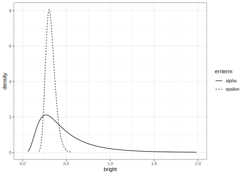
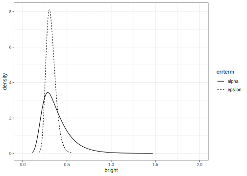
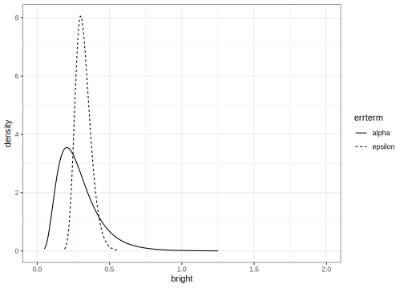
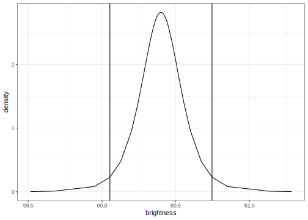

One Way Anova with a random effect
================
[Julian Faraway](https://julianfaraway.github.io/)
22 June 2022

See the [introduction](index.md) for an overview.

This example is discussed in more detail in my book [Extending the
Linear Model with R](https://julianfaraway.github.io/faraway/ELM/)

Required libraries:

``` r
library(faraway)
library(ggplot2)
library(lme4)
library(INLA)
library(knitr)
```

# Data

Load up and look at the data, which concerns the brightness of paper
which may vary between operators of the production machinery.

``` r
data(pulp, package="faraway")
summary(pulp)
```

         bright     operator
     Min.   :59.8   a:5     
     1st Qu.:60.0   b:5     
     Median :60.5   c:5     
     Mean   :60.4   d:5     
     3rd Qu.:60.7           
     Max.   :61.0           

``` r
ggplot(pulp, aes(x=operator, y=bright))+geom_point(position = position_jitter(width=0.1, height=0.0))
```

<!-- -->

You can read more about the data by typing `help(pulp)` at the R prompt.

In this example, there are only five replicates per level. There is no
strong reason to reject the normality assumption. We don’t care about
the specific operators, who are named a, b, c and d, but we do want to
know how they vary.

# Likelihood inference

We use a model of the form:


where the

and
s
are normal with mean zero, but variances

and
,
respectively.

The default fit uses the REML estimation method:

``` r
mmod <- lmer(bright ~ 1+(1|operator), pulp)
faraway::sumary(mmod)
```

    Fixed Effects:
    coef.est  coef.se 
       60.40     0.15 

    Random Effects:
     Groups   Name        Std.Dev.
     operator (Intercept) 0.26    
     Residual             0.33    
    ---
    number of obs: 20, groups: operator, 4
    AIC = 24.6, DIC = 14.4
    deviance = 16.5 

We see slightly less variation within operators (SD=0.261) than between
operators (SD=0.326).

## Hypothesis testing

We can also use the ML method:

``` r
smod <- lmer(bright ~ 1+(1|operator), pulp, REML = FALSE)
faraway::sumary(smod)
```

    Fixed Effects:
    coef.est  coef.se 
       60.40     0.13 

    Random Effects:
     Groups   Name        Std.Dev.
     operator (Intercept) 0.21    
     Residual             0.33    
    ---
    number of obs: 20, groups: operator, 4
    AIC = 22.5, DIC = 16.5
    deviance = 16.5 

The REML method is preferred for estimation but we must use the ML
method if we wish to make hypothesis tests comparing models.

If we want to test for variation between operators, we fit a null model
containing no operator, compute the likelihood ratio statistic and
corresponding p-value:

``` r
nullmod <- lm(bright ~ 1, pulp)
lrtstat <- as.numeric(2*(logLik(smod)-logLik(nullmod)))
pvalue <- pchisq(lrtstat,1,lower=FALSE)
data.frame(lrtstat, pvalue)
```

      lrtstat  pvalue
    1  2.5684 0.10902

Superficially, the p-value greater than 0.05 suggests no strong evidence
against that hypothesis that there is no variation among the operators.
But there is good reason to doubt the chi-squared null distribution when
testing parameter on the boundary of the space (as we do here at zero).
A parametric bootstrap can be used where we generate samples from the
null and compute the test statistic repeatedly:

``` r
lrstat <- numeric(1000)
set.seed(123)
for(i in 1:1000){
   y <- unlist(simulate(nullmod))
   bnull <- lm(y ~ 1)
   balt <- lmer(y ~ 1 + (1|operator), pulp, REML=FALSE)
   lrstat[i] <- as.numeric(2*(logLik(balt)-logLik(bnull)))
  }
```

Check the proportion of simulated test statistics that are close to
zero:

``` r
mean(lrstat < 0.00001)
```

    [1] 0.703

Clearly, the test statistic does not have a chi-squared distribution
under the null. We can compute the proportion that exceed the observed
test statistic of 2.5684:

``` r
mean(lrstat > 2.5684)
```

    [1] 0.019

This is a more reliable p-value for our hypothesis test which suggest
there is good reason to reject the null hypothesis of no variation
between operators.

More sophisticated methods of inference are discussed in [Extending the
Linear Model with R](https://julianfaraway.github.io/faraway/ELM/)

## Confidence intervals

We can use bootstrap again to compute confidence intervals for the
parameters of interest:

``` r
confint(mmod, method="boot")
```

                   2.5 %   97.5 %
    .sig01       0.00000  0.51451
    .sigma       0.21084  0.43020
    (Intercept) 60.11213 60.69244

We see that the lower end of the confidence interval for the operator SD
extends to zero.

## Random effects

Even though we are most interested in the variation between operators,
we can still estimate their individual effects:

``` r
ranef(mmod)$operator
```

      (Intercept)
    a    -0.12194
    b    -0.25912
    c     0.16767
    d     0.21340

Approximate 95% confidence intervals can be displayed with:

``` r
dd = as.data.frame(ranef(mmod))
ggplot(dd, aes(y=grp,x=condval)) +
        geom_point() +
        geom_errorbarh(aes(xmin=condval -2*condsd,
                           xmax=condval +2*condsd), height=0)
```

<!-- -->

# INLA

Integrated nested Laplace approximation is a method of Bayesian
computation which uses approximation rather than simulation. More can be
found on this topic in [Bayesian Regression Modeling with
INLA](http://julianfaraway.github.io/brinla/) and the [chapter on
GLMMs](https://julianfaraway.github.io/brinlabook/chaglmm.html)

Use the most recent computational methodology:

``` r
inla.setOption(inla.mode="experimental")
inla.setOption("short.summary",TRUE)
```

Run the INLA model with default priors:

``` r
imod <- inla(bright ~ f(operator, model="iid"),
             family="gaussian",
             data=pulp)
```

The summary of the posterior distribution for the fixed effects (which
is only the intercept in this example):

``` r
imod$summary.fixed |> kable()
```

|             | mean |      sd | 0.025quant | 0.5quant | 0.975quant | mode | kld |
|:------------|-----:|--------:|-----------:|---------:|-----------:|-----:|----:|
| (Intercept) | 60.4 | 0.08804 |     60.226 |     60.4 |     60.574 | 60.4 |   0 |

The posterior mean is the same as the (RE)ML estimate. The posterior
distribution of the hyperparameters (precision of the error and operator
terms)

``` r
imod$summary.hyperpar |> kable()
```

|                                         |       mean |         sd | 0.025quant |   0.5quant | 0.975quant |      mode |
|:----------------------------------------|-----------:|-----------:|-----------:|-----------:|-----------:|----------:|
| Precision for the Gaussian observations |     6.9001 |     2.1323 |     3.4886 |     6.6477 |     11.802 |    6.1674 |
| Precision for operator                  | 19274.5392 | 19883.8871 |  1312.5233 | 13253.9873 |  72158.286 | 3591.1178 |

Precision for the operator term is unreasonably high. This implies a
strong belief that there is no variation between the operators which we
would find hard to believe. This is due to the default diffuse gamma
prior on the precisions which put almost all the weight on the error
variation and not nearly enough on the operator variation. We need to
change the prior.

## Halfnormal prior on the SDs

We try a halfnormal prior with low precision instead. A precision of
0.01 corresponds to an SD of 10. (It is possible to vary the mean but we
have set this to zero to achieve a halfnormal distribution). This is
substantially larger than the SD of the response so the information
supplied is very weak.

``` r
tnprior <- list(prec = list(prior="logtnormal", param = c(0,0.01)))
imod <- inla(bright ~ f(operator, model="iid", hyper = tnprior),
               family="gaussian", 
               data=pulp)
summary(imod)
```

    Fixed effects:
                mean    sd 0.025quant 0.5quant 0.975quant mode   kld
    (Intercept) 60.4 0.305     59.778     60.4     61.022 60.4 0.062

    Model hyperparameters:
                                             mean    sd 0.025quant 0.5quant 0.975quant mode
    Precision for the Gaussian observations 10.65  3.53      5.118    10.19      18.85 9.32
    Precision for operator                  12.84 20.70      0.465     6.56      63.85 1.09

     is computed 

The results appear more plausible. Transform to the SD scale

``` r
sigmaalpha <- inla.tmarginal(function(x)1/sqrt(exp(x)),
                             imod$internal.marginals.hyperpar[[2]])
sigmaepsilon <- inla.tmarginal(function(x)1/sqrt(exp(x)),
                                imod$internal.marginals.hyperpar[[1]])
```

and output the summary statistics (note that transforming the summary
statistics on the precision scale only works for the quantiles)

``` r
sigalpha = c(inla.zmarginal(sigmaalpha, silent = TRUE),
            mode=inla.mmarginal(sigmaalpha))
sigepsilon = c(inla.zmarginal(sigmaepsilon, silent = TRUE),
              mode=inla.mmarginal(sigmaepsilon))
rbind(sigalpha, sigepsilon) 
```

               mean    sd       quant0.025 quant0.25 quant0.5 quant0.75 quant0.975 mode   
    sigalpha   0.49005 0.3552   0.12534    0.25858   0.38851  0.60367   1.4492     0.26233
    sigepsilon 0.31914 0.053532 0.23092    0.28083   0.31294  0.35112   0.44045    0.29986

The posterior mode is most comparable with the (RE)ML estimates computed
above. In this respect, the results are similar.

We can also get summary statistics on the random effects:

``` r
imod$summary.random$operator |> kable()
```

| ID  |     mean |      sd | 0.025quant | 0.5quant | 0.975quant |     mode |     kld |
|:----|---------:|--------:|-----------:|---------:|-----------:|---------:|--------:|
| a   | -0.13022 | 0.31878 |   -0.79588 | -0.11920 |    0.49159 | -0.08787 | 0.05259 |
| b   | -0.27660 | 0.32374 |   -0.96829 | -0.26034 |    0.32192 | -0.23315 | 0.04973 |
| c   |  0.17903 | 0.32011 |   -0.43505 |  0.16571 |    0.85337 |  0.13410 | 0.05175 |
| d   |  0.22776 | 0.32164 |   -0.37825 |  0.21259 |    0.91058 |  0.18533 | 0.05098 |

Plot the posterior densities for the two SD terms:

``` r
ddf <- data.frame(rbind(sigmaalpha,sigmaepsilon),
                  errterm=gl(2,dim(sigmaalpha)[1],labels = c("alpha","epsilon")))
ggplot(ddf, aes(x,y, linetype=errterm))+
  geom_line()+xlab("bright")+ylab("density")+xlim(0,2)
```

<!-- -->

We see that the operator SD less precisely known than the error SD.
Although the mode for the operator is smaller, there is a substantial
chance it could be much higher than the error SD.

Is there any variation between operators? We framed this question as an
hypothesis test previously but that is not sensible in this framework.
We might ask the probability that the operator SD is zero. Since we have
posited a continuous prior that places no discrete mass on zero, the
posterior probability will be zero, regardless of the data. Instead we
might ask the probability that the operator SD is small. Given the
response is measured to one decimal place, 0.1 is a reasonable
representation of *small* if we take this to mean the smallest amount we
care about.

We can compute the probability that the operator SD is smaller than 0.1:

``` r
inla.pmarginal(0.1, sigmaalpha)
```

    [1] 0.0086522

The probability is small but not entirely negligible.

# Informative gamma priors on the precisions

Now try more informative gamma priors for the precisions. Define it so
the mean value of gamma prior is set to the inverse of the variance of
the response. We expect the two error variances to be lower than the
response variance so this is an overestimate. The variance of the gamma
prior (for the precision) is controlled by the `apar` shape parameter in
the code. `apar=1` is the exponential distribution. Shape values less
than one result in densities that have a mode at zero and decrease
monotonely. These have greater variance and hence less informative.

``` r
apar <- 0.5
bpar <- var(pulp$bright)*apar
lgprior <- list(prec = list(prior="loggamma", param = c(apar,bpar)))
imod <- inla(bright ~ f(operator, model="iid", hyper = lgprior),
               family="gaussian", 
               data=pulp)
summary(imod)
```

    Fixed effects:
                mean    sd 0.025quant 0.5quant 0.975quant mode   kld
    (Intercept) 60.4 0.209      59.98     60.4      60.82 60.4 0.002

    Model hyperparameters:
                                             mean   sd 0.025quant 0.5quant 0.975quant mode
    Precision for the Gaussian observations 10.62 3.52       5.10    10.18      18.80 9.31
    Precision for operator                  11.08 9.23       1.58     8.57      35.42 4.38

     is computed 

Compute the summaries as before:

``` r
sigmaalpha <- inla.tmarginal(function(x)1/sqrt(exp(x)),
                             imod$internal.marginals.hyperpar[[2]])
sigmaepsilon <- inla.tmarginal(function(x)1/sqrt(exp(x)),
                            imod$internal.marginals.hyperpar[[1]])
sigalpha = c(inla.zmarginal(sigmaalpha, silent = TRUE),
            mode=inla.mmarginal(sigmaalpha))
sigepsilon = c(inla.zmarginal(sigmaepsilon, silent = TRUE),
              mode=inla.mmarginal(sigmaepsilon))
rbind(sigalpha, sigepsilon) 
```

               mean    sd       quant0.025 quant0.25 quant0.5 quant0.75 quant0.975 mode   
    sigalpha   0.37698 0.16127  0.16873    0.26375   0.34048  0.45065   0.78993    0.28118
    sigepsilon 0.31947 0.053663 0.23124    0.28105   0.31317  0.35147   0.44126    0.29983

Slightly different outcome.

Make the plots:

``` r
ddf <- data.frame(rbind(sigmaalpha,sigmaepsilon),
                  errterm=gl(2,dim(sigmaalpha)[1],labels = c("alpha","epsilon")))
ggplot(ddf, aes(x,y, linetype=errterm))+
  geom_line()+xlab("bright")+ylab("density")+xlim(0,2)
```

<!-- -->

The posterior for the error SD is quite similar to that seen previously
but the operator SD is larger and bounded away from zero and less
dispersed.

We can compute the probability that the operator SD is smaller than 0.1:

``` r
inla.pmarginal(0.1, sigmaalpha)
```

    [1] 3.2377e-05

The probability is very small. The choice of prior may be unsuitable in
that no density is placed on an SD=0 (or infinite precision). We also
have very little prior weight on low SD/high precision values. This
leads to a posterior for the operator with very little density assigned
to small values of the SD. But we can see from looking at the data or
from prior analyses of the data that there is some possibility that the
operator SD is very small.

# Penalized Complexity Prior

In [Simpson (2017)](https://doi.org/10.1214/16-STS576), penalized
complexity priors are proposed. This requires that we specify a scaling
for the SDs of the random effects. We use the SD of the residuals of the
fixed effects only model (what might be called the base model in the
paper) to provide this scaling.

``` r
sdres <- sd(pulp$bright)
pcprior <- list(prec = list(prior="pc.prec", param = c(3*sdres,0.01)))
imod <- inla(bright ~ f(operator, model="iid", hyper = pcprior),
               family="gaussian", 
               data=pulp)
summary(imod)
```

    Fixed effects:
                mean    sd 0.025quant 0.5quant 0.975quant mode kld
    (Intercept) 60.4 0.172     60.051     60.4     60.749 60.4   0

    Model hyperparameters:
                                             mean    sd 0.025quant 0.5quant 0.975quant mode
    Precision for the Gaussian observations 10.59  3.52       5.05    10.14      18.76 9.28
    Precision for operator                  24.46 32.63       2.28    14.72     106.69 5.85

     is computed 

Compute the summaries as before:

``` r
sigmaalpha <- inla.tmarginal(function(x)1/sqrt(exp(x)),
                             imod$internal.marginals.hyperpar[[2]])
sigmaepsilon <- inla.tmarginal(function(x)1/sqrt(exp(x)),
                            imod$internal.marginals.hyperpar[[1]])
sigalpha = c(inla.zmarginal(sigmaalpha, silent = TRUE),
            mode=inla.mmarginal(sigmaalpha))
sigepsilon = c(inla.zmarginal(sigmaepsilon, silent = TRUE),
              mode=inla.mmarginal(sigmaepsilon))
rbind(sigalpha, sigepsilon) 
```

               mean    sd       quant0.025 quant0.25 quant0.5 quant0.75 quant0.975 mode   
    sigalpha   0.29046 0.14571  0.097268   0.18631   0.26054  0.36042   0.65745    0.20635
    sigepsilon 0.32014 0.054103 0.23149    0.28139   0.31367  0.35231   0.4432     0.29985

We get a similar result to the truncated normal prior used earlier
although the operator SD is generally smaller.

Make the plots:

``` r
ddf <- data.frame(rbind(sigmaalpha,sigmaepsilon),
                  errterm=gl(2,dim(sigmaalpha)[1],labels = c("alpha","epsilon")))
ggplot(ddf, aes(x,y, linetype=errterm))+
  geom_line()+xlab("bright")+ylab("density")+xlim(0,2)
```

<!-- -->

We can compute the probability that the operator SD is smaller than 0.1:

``` r
inla.pmarginal(0.1, sigmaalpha)
```

    [1] 0.02839

The probability is small but not insubstantial.

We can plot the posterior density of

along with a 95% credibility interval:

``` r
mu <- data.frame(imod$marginals.fixed[[1]])
cbound = inla.qmarginal(c(0.025,0.975),mu)
ggplot(mu, aes(x,y)) + geom_line() + 
  geom_vline(xintercept = cbound) +
  xlab("brightness")+ylab("density")
```

<!-- -->

We can plot the posterior marginals of the random effects:

``` r
nlevels = length(unique(pulp$operator))
rdf = data.frame(do.call(rbind,imod$marginals.random$operator))
rdf$operator = gl(nlevels,nrow(rdf)/nlevels,labels=1:nlevels)
ggplot(rdf,aes(x=x,y=y,group=operator, color=operator)) + 
  geom_line() +
  xlab("") + ylab("Density")
```

<!-- -->

We see that operators 1 and 2 tend to be lower than 3 and 4. There is
substantial overlap so we would hesitate to declare any difference
between a pair of operators.

# Package version info

``` r
sessionInfo()
```

    R version 4.2.0 (2022-04-22)
    Platform: x86_64-apple-darwin17.0 (64-bit)
    Running under: macOS Big Sur/Monterey 10.16

    Matrix products: default
    BLAS:   /Library/Frameworks/R.framework/Versions/4.2/Resources/lib/libRblas.0.dylib
    LAPACK: /Library/Frameworks/R.framework/Versions/4.2/Resources/lib/libRlapack.dylib

    locale:
    [1] en_GB.UTF-8/en_GB.UTF-8/en_GB.UTF-8/C/en_GB.UTF-8/en_GB.UTF-8

    attached base packages:
    [1] parallel  stats     graphics  grDevices utils     datasets  methods   base     

    other attached packages:
    [1] knitr_1.39      INLA_22.06.20-2 sp_1.4-7        foreach_1.5.2   lme4_1.1-29     Matrix_1.4-1    ggplot2_3.3.6  
    [8] faraway_1.0.8  

    loaded via a namespace (and not attached):
     [1] tidyselect_1.1.2   xfun_0.31          purrr_0.3.4        splines_4.2.0      lattice_0.20-45    colorspace_2.0-3  
     [7] vctrs_0.4.1        generics_0.1.2     htmltools_0.5.2    yaml_2.3.5         utf8_1.2.2         rlang_1.0.2       
    [13] pillar_1.7.0       nloptr_2.0.3       glue_1.6.2         withr_2.5.0        DBI_1.1.2          lifecycle_1.0.1   
    [19] stringr_1.4.0      MatrixModels_0.5-0 munsell_0.5.0      gtable_0.3.0       codetools_0.2-18   evaluate_0.15     
    [25] labeling_0.4.2     fastmap_1.1.0      fansi_1.0.3        highr_0.9          Rcpp_1.0.8.3       scales_1.2.0      
    [31] systemfonts_1.0.4  farver_2.1.0       Deriv_4.1.3        digest_0.6.29      stringi_1.7.6      dplyr_1.0.9       
    [37] grid_4.2.0         cli_3.3.0          tools_4.2.0        magrittr_2.0.3     tibble_3.1.7       crayon_1.5.1      
    [43] pkgconfig_2.0.3    ellipsis_0.3.2     MASS_7.3-57        svglite_2.1.0      assertthat_0.2.1   minqa_1.2.4       
    [49] rmarkdown_2.14     rstudioapi_0.13    iterators_1.0.14   R6_2.5.1           boot_1.3-28        nlme_3.1-157      
    [55] compiler_4.2.0    
